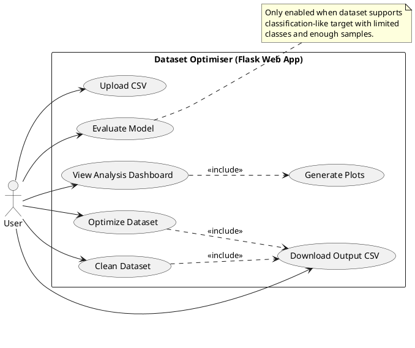
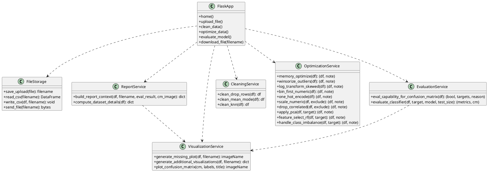
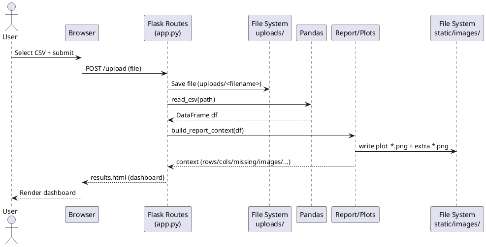
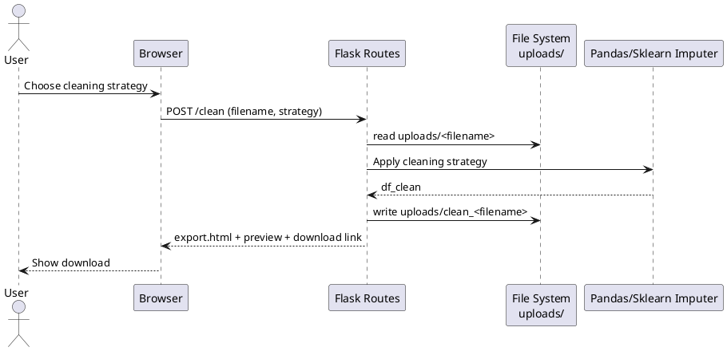
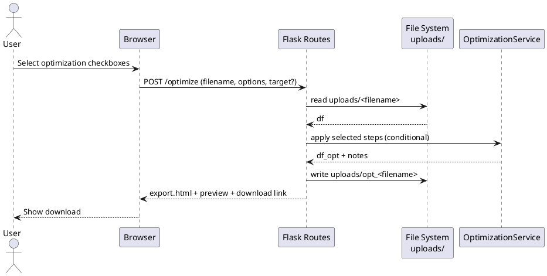
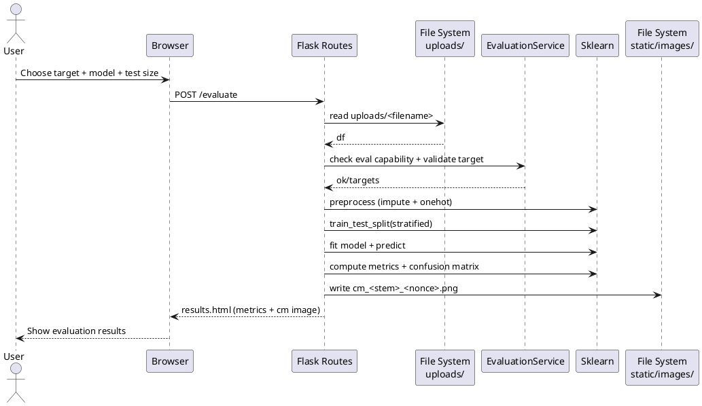
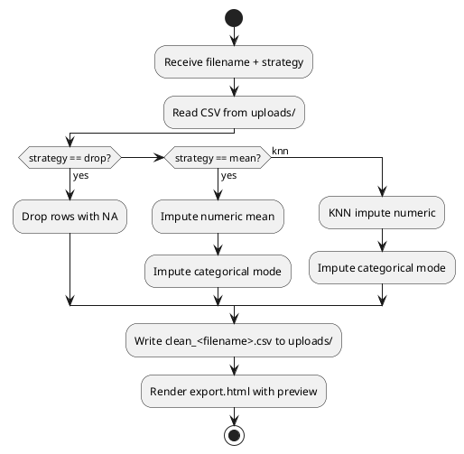
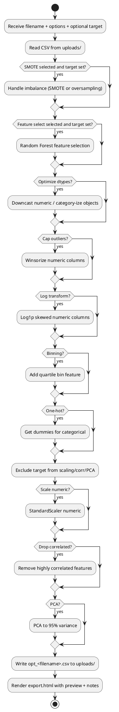
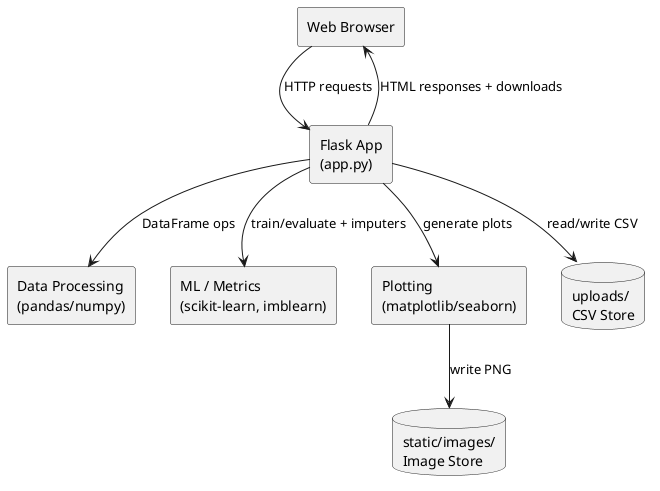
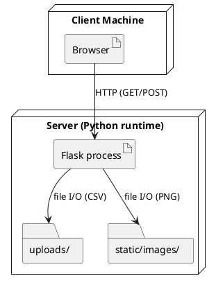

# Dataset Optimiser — DFD + UML Diagrams

This document provides Data Flow Diagrams (DFD) and UML diagrams for the **Dataset Optimiser** Flask application (see [app.py](../app.py)).

## Notation

- **External Entity**: outside the system boundary (User/Browser)
- **Process**: transformation of data (Upload/Analyze/Clean/Optimize/Evaluate/Download)
- **Data Store**: persistent storage (CSV files in `uploads/`, images in `static/images/`)

---

## DFD — Level 0 (Context Diagram)

```mermaid
flowchart LR
  U[External Entity: User (Browser)]
  S((Process: Dataset Optimiser Web App))

  DS1[(Data Store: uploads/ (CSV files))]
  DS2[(Data Store: static/images/ (plots))]

  U -- "Upload CSV" --> S
  S -- "Save uploaded CSV" --> DS1

  S -- "Analysis dashboard (HTML)" --> U
  S -- "Generate plots" --> DS2

  U -- "Request clean/optimize/evaluate" --> S
  S -- "Write cleaned/optimized CSV" --> DS1

  U -- "Download request" --> S
  S -- "Send CSV file" --> U
```

---

## DFD — Level 1 (Major Processes)

```mermaid
flowchart TB
  U[External Entity: User (Browser)]

  P1((1. Upload Dataset
POST /upload))
  P2((2. Analyze Dataset
_build_report_context))
  P3((3. Clean Dataset
POST /clean))
  P4((4. Optimize Dataset
POST /optimize))
  P5((5. Evaluate Model
POST /evaluate))
  P6((6. Download Output
GET /download/<filename>))

  DS1[(uploads/: original/clean_/opt_ CSVs)]
  DS2[(static/images/: plots & confusion matrices)]

  U -- CSV file --> P1
  P1 -- saved CSV path --> DS1
  P1 -- filename --> P2

  DS1 -- read CSV --> P2
  P2 -- plots --> DS2
  P2 -- dashboard HTML (results.html) --> U

  U -- strategy + filename --> P3
  DS1 -- read CSV --> P3
  P3 -- cleaned CSV --> DS1
  P3 -- export HTML (export.html) --> U

  U -- options + filename + optional target --> P4
  DS1 -- read CSV --> P4
  P4 -- optimized CSV --> DS1
  P4 -- export HTML (export.html) --> U

  U -- target + model + test_size + filename --> P5
  DS1 -- read CSV --> P5
  P5 -- confusion matrix plot --> DS2
  P5 -- dashboard HTML (results.html with metrics) --> U

  U -- output filename --> P6
  DS1 -- file bytes --> P6
  P6 -- downloaded file --> U
```

---

## DFD — Level 2 (Optimization Pipeline Detail)

```mermaid
flowchart LR
  U[User]
  P4((Optimize Dataset
POST /optimize))
  DS1[(uploads/)]

  subgraph OPT[Optimization Steps (conditional by checkboxes)]
    O1[SMOTE / Oversampling\n_handle_class_imbalance]
    O2[RF Feature Selection\n_feature_select_rf]
    O3[Memory Optimize DTypes\n_memory_optimize]
    O4[Winsorize Outliers\n_winsorize_outliers]
    O5[Log Transform Skewed\n_log_transform_skewed]
    O6[Binning\n_bin_first_numeric]
    O7[One-Hot Encoding\n_one_hot_encode]
    O8[Scaling\n_scale_numeric]
    O9[Drop Correlated\n_drop_correlated]
    O10[PCA\n_apply_pca]
  end

  U -- "options + target (optional)" --> P4
  DS1 -- "read original CSV" --> P4

  P4 --> O1 --> O2 --> O3 --> O4 --> O5 --> O6 --> O7 --> O8 --> O9 --> O10

  O10 -- "write opt_<filename>.csv" --> DS1
  P4 -- "export.html + preview + notes" --> U
```

---

# UML Diagrams (PlantUML)

These are **conceptual UML diagrams** that map directly to what the code in [app.py](../app.py) does.

## UML — Use Case Diagram



---

## UML — Class Diagram (Conceptual)



---

## UML — Sequence Diagram (Upload + Analyze)



---

## UML — Sequence Diagram (Clean Dataset)



---

## UML — Sequence Diagram (Optimize Dataset)



---

## UML — Sequence Diagram (Evaluate Model)



---

## UML — Activity Diagram (Cleaning)



---

## UML — Activity Diagram (Optimization)



---

## UML — Component Diagram



---

## UML — Deployment Diagram


